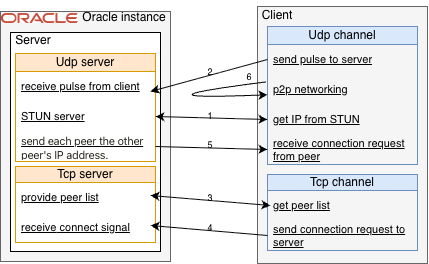

## Overview
**PeerCon** is a peer-to-peer desktop sharing application built entirely with **Java JDK**, utilizing **no external dependencies**.  
I started this project while studying **Netty**. I wanted to explore **pure Java networking (Java NIO)** without relying on abstraction layers like Netty. I aim to understand the core mechanisms of low-level networking, including **UDP hole punching** and **non-blocking I/O**.

## Screenshots

This shows a screen being shared with another PC in real time.

## Architecture

- The server handles requests using a selector and worker-thread architecture.
- The client uses blocking channels because the request volume is not high.
- After a connection is established via UDP hole punching, screen sharing is implemented by capturing the screen and transmitting the captured frames between peers.

## Learnings
#### [Server](https://github.com/clapppp/PeerCon-Server)
- Understood the roles of STUN and TURN servers in direct peer-to-peer communication environments.
- Learned when to use blocking I/O and why a selector is needed to manage multiple sockets with non-blocking I/O.
- Identified the limitations of P2P communication under symmetric NAT/router environments and the need for a TURN server.
- Designed a custom protocol and handled raw data directly.
- Implemented TCP and UDP communication using Java NIO.
#### Client
- Built screen capture and compression features using Java’s Robot class.
- Implemented direct communication through NAT hole punching.
- Investigated issues caused by symmetric NAT environments and applied appropriate workarounds.
- Understood why private IP-based communication is needed when peers are under the same public IP.
- Designed a custom protocol and handled raw data directly.
- Built TCP and UDP communication features using Java NIO.

## How to run
```
git clone https://github.com/clapppp/PeerCon-client.git
cd PeerCon-client/target
java -jar client-1.0.jar
```
